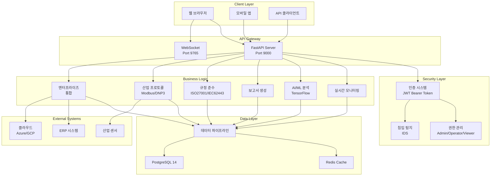
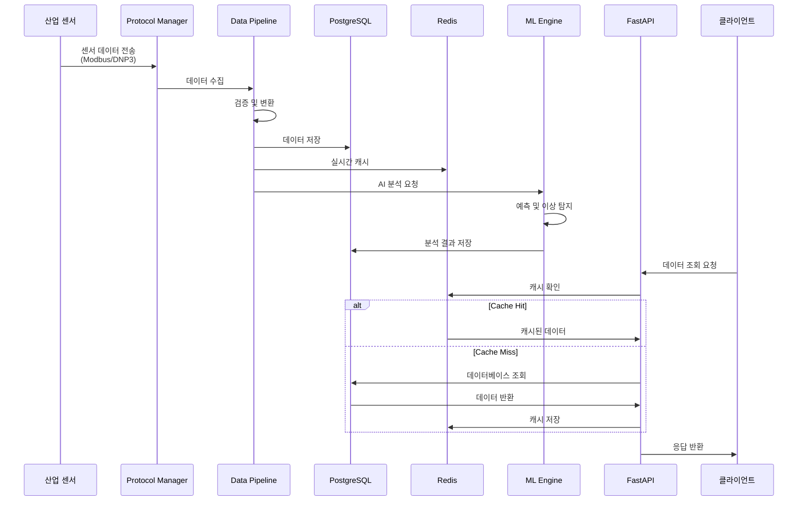
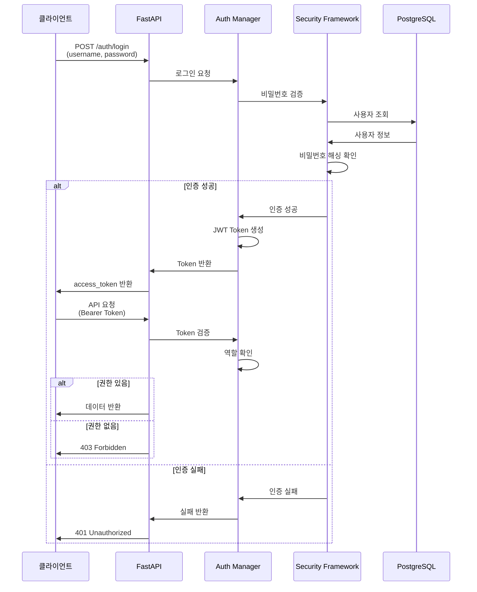
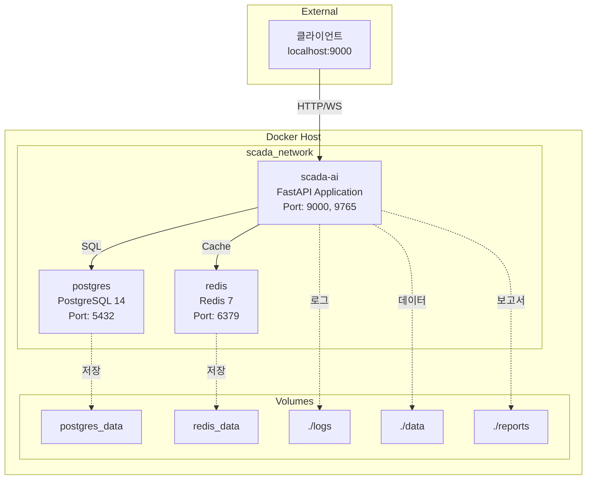
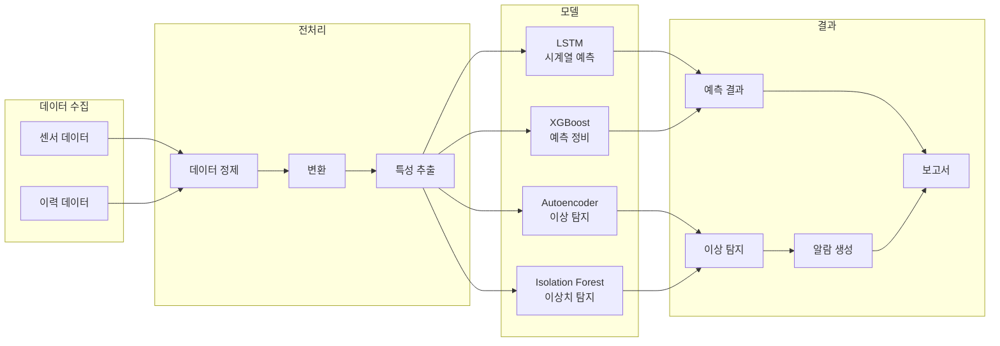
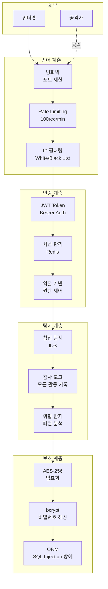
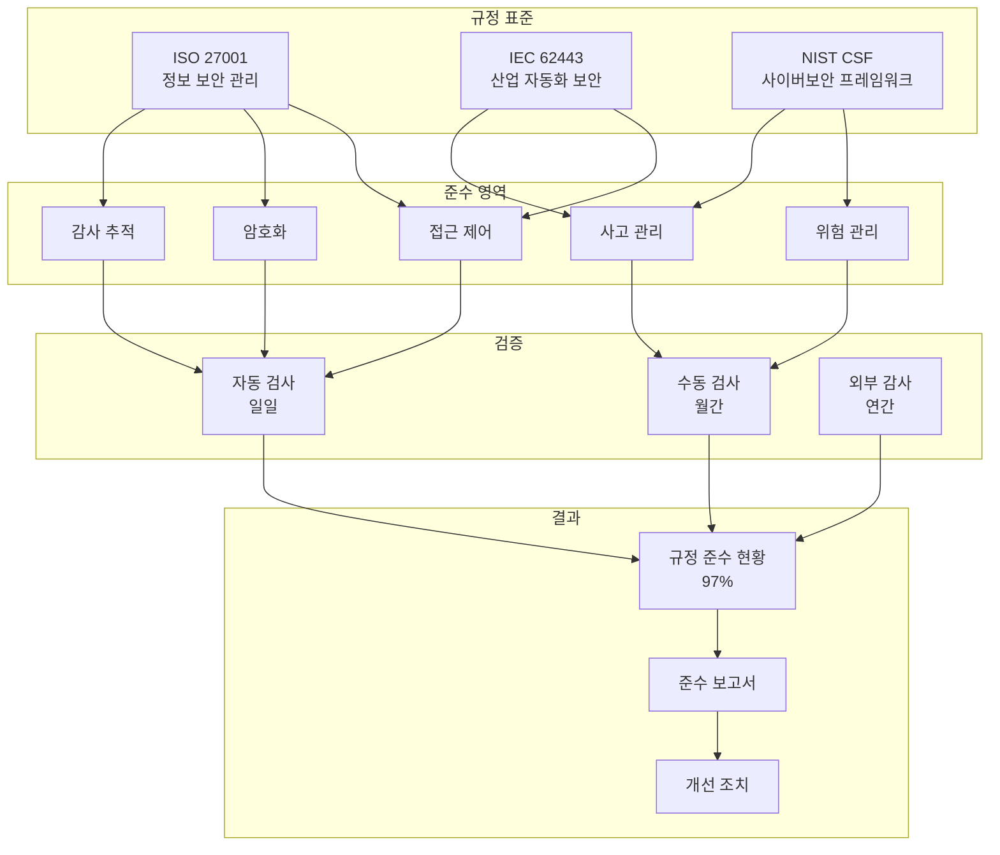

# SCADA AI 시스템 아키텍처 다이어그램

## 1. 전체 시스템 아키텍처



## 2. 데이터 흐름 다이어그램



## 3. 인증 흐름 다이어그램



## 4. Docker 컨테이너 구조



## 5. AI/ML 파이프라인



## 6. 보안 계층 구조



## 7. 규정 준수 프레임워크



## 8. 배포 파이프라인 (향후)

```mermaid
graph LR
    subgraph "개발"
        Code[코드 작성]
        Test[단위 테스트]
        Commit[Git Commit]
    end

    subgraph "CI"
        Build[Docker Build]
        IntTest[통합 테스트]
        Security[보안 검사]
    end

    subgraph "CD"
        Stage[Staging 배포]
        E2E[E2E 테스트]
        Prod[Production 배포]
    end

    subgraph "모니터링"
        Health[헬스 체크]
        Metrics[메트릭 수집]
        Alert[알람]
    end

    Code --> Test
    Test --> Commit
    Commit --> Build
    Build --> IntTest
    IntTest --> Security
    Security --> Stage
    Stage --> E2E
    E2E --> Prod
    Prod --> Health
    Health --> Metrics
    Metrics --> Alert
```



---

**사용 방법**:

1. **GitHub에서 보기**: GitHub에 업로드하면 Mermaid 다이어그램이 자동으로 렌더링됩니다.

2. **VS Code에서 보기**: "Markdown Preview Mermaid Support" 확장 프로그램 설치

3. **온라인 에디터**:
   - https://mermaid.live/ (Mermaid 온라인 에디터)
   - 코드 복사 → 붙여넣기 → PNG/SVG 다운로드

4. **PDF 변환**:
   ```bash
   # Mermaid CLI 설치 (Node.js 필요)
   npm install -g @mermaid-js/mermaid-cli

   # PNG로 변환
   mmdc -i system_architecture.md -o architecture.png
   ```

**문서 버전**: 1.0
**작성일**: 2025년 10월 14일
